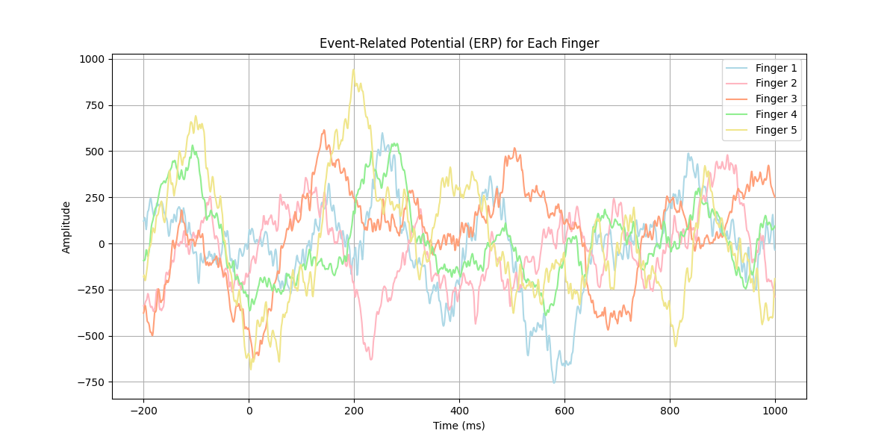

# **Event-Related Potential (ERP) Analysis**

## **Description**

This code calculates the mean Event-Related Potential (ERP) for five fingers based on trial points and ECoG brain signal data. It extracts relevant signal data for each finger, averages it across trials, and plots the ERP for all fingers on a single graph. The code takes as input two CSV files: one containing trial points (starting and peak points, along with finger number) and another with ECoG brain signal data. The output includes both a plot of ERP and a printed matrix showing the averaged ERP values for each finger.

## **Input Files**

- **Trial Points CSV**: Contains trial data with columns for the starting point, peak point, and finger number.
- **ECoG Data CSV**: Contains the brain data for each trial.

## **Output**

- A plot showing the mean ERP for each finger.
- A printed matrix with averaged ERP values.

## **Visualization**

